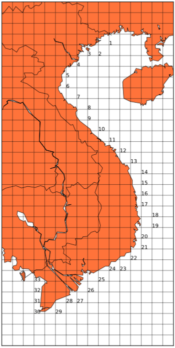
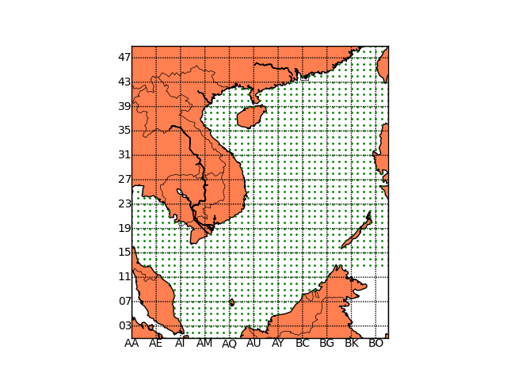

# WaveGrib
Extract ocean waves time series for various locations from NOAA WaveWatch III reanalysis Grib files 

The NOAA WaveWatch III reanalysis wave data global coverage has a spatial resolution of 0.5° and a sampling interval of 3 hours. Being organised in `grib` file format, the data can be conveniently retrieved as map layers. But retrieving data as time series for particular location is not straightforward. 

This code repository provides an example to extract the wave data including the significant wave height, peak wave period and mean wave direction from the selected location.

## Data download

Run `download.py` to acquire `*.grb2` files from the NOAA server. Please adjust the year and month ranges in the source file accordingly to your need.

## Data extraction

### Discrete samples

Data can be extracted for a list of discrete points, for example the 33 locations along the Vietnam coastline shown in the figure. 
Run `extract_wave_VN.py` with the starting month, length of data to be extracted, and output file name. For example, the following command will extract two-month data starting from August 2010, and store the text output into the file `Aug2010.txt`.

```console
$ python extract_wave_VN.py 201008 2 Aug2010
```

Note: the current directory must be `src`.



### Zonal

In a similar vein, extracting time series for a sea region can be done. For example, the script `extract_wave_data_zone.py` will extract wave data in a region of the South China Sea spanning from longitude 100°E to 121°E, latitude from 1°N to 25°N. To extract Feb-2011 dataset and name the zone as `SCS` (output file `wave_zone_SCS_201102.txt`):

```console
$ python extract_wave_data_zone.py SCS 201102 1
```

Note: the current directory must be `src`.



## Speed

Since GRIB files are prepared as "map layers", it is time-consuming to drill down these layers to extract the time series. As tested on Mac OS X (4 GB RAM, 1.4 GHz CPU): 

- Discrete sampling for the year 2011: CPU time 1236 seconds
- Zonal sampling for February 2011: CPU time 125 seconds

The code is updated for Python 3.

The previous version used default Python, not Anaconda Python; but now for recent versions of Python 3, Anaconda works fine.